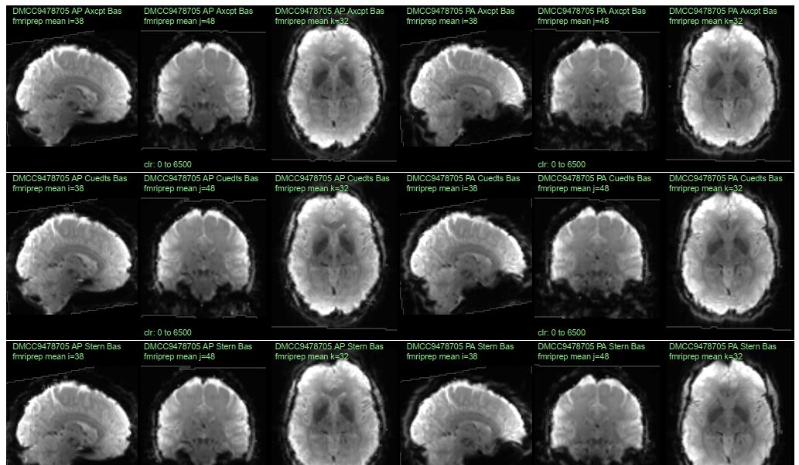
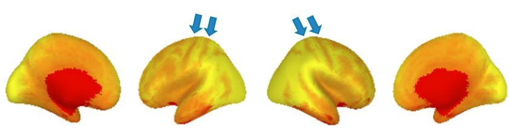
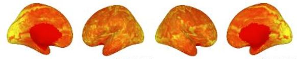
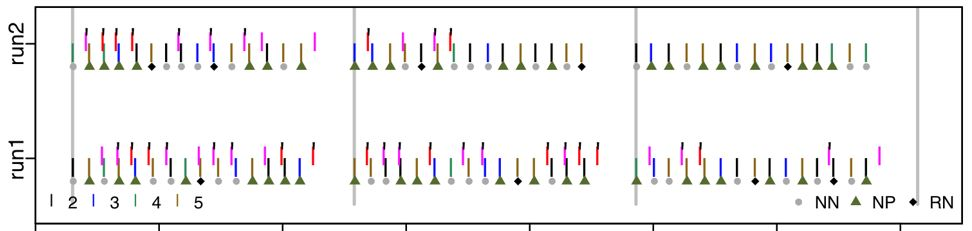

---
jupyter:
  jupytext:
    notebook_metadata_filter: all,-language_info
    split_at_heading: true
    text_representation:
      extension: .Rmd
      format_name: rmarkdown
  kernelspec:
    display_name: R
    language: R
    name: ir
---

# Highlight important and diagnostic features as efficiently as possible
Given human nature, even the best QC reports won't be consistently used if they are too long, ugly, or annoying. It is often more effective to quickly create short, aesthetically pleasing QC files which emphasize easy-to-check diagnostic features. If these summary files suggest something may be amiss, it can be investigated in detail; trying to fit all possibly-useful images and statistics into one document is often counterproductive.

For checking the preprocessing of human fMRI data, we have found that it works well to plot temporal mean images and confirm that the volumes **look like brains**. This is especially valuable if all of the participants' runs are plotted side-by-side, like below (10 runs can fit on a single page, e.g., pages 12-14 of [132017_fMRI_movementSummary_fmriprep.pdf](https://osf.io/z62s5/)), enabling many runs to be examined at a glance, and differences between the runs to be spotted.


Surface temporal mean images are more difficult to check for preprocessing errors, because a correctly-made gifti file can always be displayed as a brain. But gross errors can still be spotted (below, right); my suggestion is to check for **tiger stripes** along the top of the hemispheres due to the central sulcus (below, left). Pages 15-17 of [132017_fMRI_movementSummary_fmriprep.pdf](https://osf.io/z62s5/) show an array of surface temporal mean images.
  

## Visual displays can help with more than image quality
These examples are of visual displays for checking image quality, but plots can be used to efficiently examine other things, too, such as task performance. This plot shows what a participant did during the [DMCC Sternberg task](https://doi.org/10.1038/s41597-022-01226-4). Time is along the x-axis, and each grey-ish plotting symbol indicates a trial onset (NN, NP, RN, 5:8 refer to trial types). The pink and red lines show each button press, with the black tick marks indicating if the response was correct. With a bit of practice a lot of task and performance information can be quickly seen in these types of plots, including trial jitter, randomization, and strange participant responses. For example, this participant gave the incorrect response for several trials in each run and block, but got the great majority correct, suggesting that they were attending to the task and trying to do it properly.


By contrast, this participant responded to a few trials, sometimes correctly, but mostly did not, and the RAs noted that the person was sleepy: we do not want to include this person's data in the analyses. It is important to be able to check for this (and other) strange response patterns. For example, if an analysis shows only the percent of responded-to trials with the correct response, this person's performance seems quite good (most trials with a response are correct); the high proportion of trials without a response needs to be considered as well.


## Example: fMRI volume (nifti) image plotting
Efficiently displaying QC images depends upon being able to easily access and plot the source files. The tutorial demonstrates basic image reading and plotting, the key foundation skill upon which the more complex files (see links at the end of this page) are built.

```{r}
library(RNifti);  # package for NIfTI image reading; https://github.com/jonclayden/RNifti

# S1200_AverageT1w_81x96x81.nii.gz (https://osf.io/6hdxv/) is a resampled (via afni 3dresample) 
# version of S1200_AverageT1w_restore.nii.gz, the HCP 1200 Group Average anatomy, 
# available from https://balsa.wustl.edu/file/show/7qX8N. 
img <- readNifti("example2files/S1200_AverageT1w_81x96x81.nii.gz");  

# the image values are in a 3d array (since this is a single anatomical image, not a timeseries)
print(dim(img));   # [1] 81 96 81
```
Now that the image is read in, many of the normal R commands and operations can be used with it, such as getting the value of individual voxels.
```{r}
print(max(img));  # [1] 1374.128
print(img[30,20,50]);  # value of the voxel at 30,20,50
```

Slices through the image can be plotted with the same functions as any other image.
```{r}
options(repr.plot.width=8, repr.plot.height=3);  # specify size in jupyter
layout(matrix(1:3, c(1,3)));  # have three images in one row
par(mar=c(0.1, 0.1, 0.1, 0.1));   # specify plot margins

image(img[15,,], col=gray(0:64/64), xlab="", ylab="", axes=FALSE, useRaster=TRUE);   # plot slice i=15
image(img[,20,], col=gray(0:64/64), xlab="", ylab="", axes=FALSE, useRaster=TRUE);   # plot slice j=20
image(img[,,50], col=gray(0:64/64), xlab="", ylab="", axes=FALSE, useRaster=TRUE);   # plot slice k=50
```

Many more neuroimaging-specific plotting functions are available (and not only for R), some static, some interactive. I suggest using the [RNifti](https://github.com/jonclayden/RNifti), [gifti](https://github.com/muschellij2/gifti), and [ciftiTools](https://github.com/mandymejia/ciftiTools) R packages for file i/o; each includes plotting functions as well. I [wrote tutorials](https://mvpa.blogspot.com/2020/03/volume-and-surface-brain-plotting-knitr.html) for working with nifti and gifti images using these libraries, plus my markdown-friendly plotting functions.

## Additional examples and notes
- [when making QC (or most any) images, don't mask the brain ...](https://mvpa.blogspot.com/2020/02/when-making-qc-or-most-any-images-dont.html)
- The DMCC55B [dataset descriptor paper](https://doi.org/10.1038/s41597-022-01226-4) supplemental files include multiple QC summary files, using R, knitr (latex), and afni. Particularly relevant here are the [temporal mean, SD, and tSNR](https://mvpa.blogspot.com/2021/06/dmcc55b-supplemental-as-tutorial-basic_18.html) and [motion (realignment parameters)](https://mvpa.blogspot.com/2021/06/dmcc55b-supplemental-as-tutorial-basic.html) examples. Those links are to blog posts describing the supplemental materials, which reside at <https://osf.io/vqe92/>.
- Examples of the files created for each [DMCC](https://sites.wustl.edu/dualmechanisms/) participant may also be useful; see <https://osf.io/z62s5/> and other files in the *analyses* subdirectory. More task behavior summary images and the source code are at <https://osf.io/7xkq9/>.
