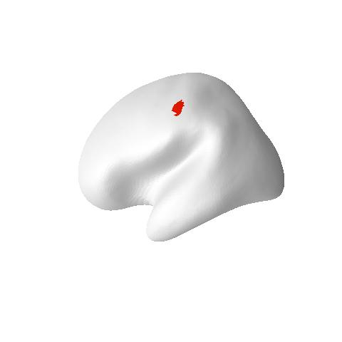
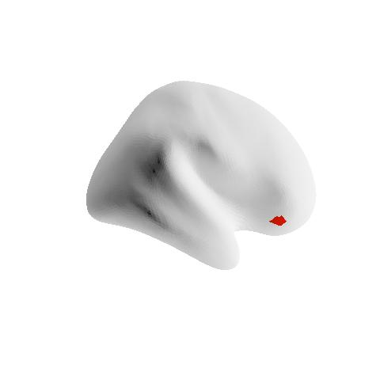

---
jupyter:
  jupytext:
    notebook_metadata_filter: all,-language_info
    split_at_heading: true
    text_representation:
      extension: .Rmd
      format_name: rmarkdown
  kernelspec:
    display_name: R
    language: R
    name: ir
---

# Create and consistently perform control analyses
### What are control analyses?
Control analyses are analyses *for dataset QC*; they are and must be separate from the experimental questions and target analyses. **Positive control analyses** check for the existence of effects that *must* be present if the dataset is valid. If those effects are not detected, we know that something is wrong in the dataset or analysis, and work should not proceed until the issues are resolved. Stated another way, a positive control analysis is one that is not of experimental interest, but has a very predictable outcome; so predictable that we are concerned if it is not found.

The [DMCC55B supplemental](https://mvpa.blogspot.com/2021/06/dmcc55b-supplemental-as-tutorial_24.html) includes two of my favorite positive control analyses, **"buttons"** and **"ONs"**, which can be adapted a wide variety of task paradigms. "buttons" is shorthand for analyzing the activity associated with the task responses (e.g., moving fingers to press buttons). Task responses like button presses are excellent targets for positive controls because the occurrence of movement can be objectively verified (unlike e.g., psychological states, whose existence is necessarily inferred), and motor activity is generally strong, focal, and located in a [low g-factor area](https://doi.org/10.1016/j.neuroimage.2021.117965) (i.e., with better fMRI SNR). Further, it is nearly always possible to design a control analysis of the responses that is not tied to the experimental hypotheses. (To avoid circularity, control analyses must be independent of experimental hypotheses.) "ONs" is shorthand for "on-task": contrasting BOLD during *all* task trials against baseline. We expect task-relevant areas (such as visual if trials include a visual stimulus) to have ONs responses resembling the HRF. 

A control analysis can be extremely valuable for identifying dataset errors (see examples below), even if it is quite different than the experimental effects of interest, but when possible, more tailored control analyses can be even more useful. For example, an experiment targeting reward processes likely has regions of interest much more towards the middle of the brain than the M1 relevant in a "buttons" control analysis; it would be possible for image SNR to be sufficient to detect button-pressing but not reward-related activity. In cases like these I suggest considering whether a more relevant control analysis is possible. For example, suppose the experimental questions are about the impact of different reward trial instructions, and the paradigm includes intermixed no-reward catch trials. If the contrast of reward and no-reward trials is not of experimental interest it could serve as a positive control (and also as an indication of an upper limit for effect size, since it is likely that the reward > no-reward effect would be larger than a modulation in reward effect caused by the experimental manipulation). 

In certain cases a negative control analysis may also be relevant, such as that color is not the dominant factor in a visual experiment. Negative control analyses must be designed and used with great caution, however, and in conjunction with positive controls, not instead of them: there are many, many reasons to not find an effect, and a single analysis likely will not be able to distinguish the reasons.

Positive control analyses can also serve as a way of evaluating signal strength and quality, both at the individual and group levels. For example, suppose a participant has unusual looking scans and it is unclear whether their data is usable. If the control analyses fail, you can be confident that excluding those scans is the correct choice. For another example, if you do not find a hoped-for experimental effect but the control analyses are clear and strong, you can be confident that a straightforward dataset QC error (e.g., mismatched trial onsets) was not to blame for the lack of experimental effect. Conversely, if a cognitive experimental effect is found but the (presumably) stronger and more focal motor effect in a buttons control analysis is not, I am unlikely to have much confidence in the cognitive effect.

## Example: DMCC55B Stroop ONs timecourses
### Task and control test
This example uses Stroop task fMRI data from the first five DMCC55B participants; see the DMCC55B [dataset descriptor paper](https://doi.org/10.1038/s41597-022-01226-4) and supplementals for more details, explanation, and the [full dataset](https://openneuro.org/datasets/ds003465/).

This is a color-word Stroop, with spoken responses. Each participant completed two task runs. The task trials are very short: a color word is shown, printed in colored ink, and the participant names the ink color as quickly as possible. Thus, we expect trial-related BOLD activations to be strong and consistent in both visual (word stimulus) and motor (spoken answer) regions (likely other regions as well, but if the participant is performing the task they *must* have motor and visual involvement). The BOLD change in these regions should resemble a [canonical HRF](https://en.wikibooks.org/wiki/SPM/Haemodynamic_Response_Function), peaking 4-8 seconds after stimulus onset. Task-related BOLD activations should be more apparent in the motor and visual areas than others, such as default mode.

### Implementing the control test
We will use the [Schaefer2018_LocalGlobal](https://github.com/ThomasYeoLab/CBIG/tree/master/stable_projects/brain_parcellation/Schaefer2018_LocalGlobal) 1000 parcels x 17 networks parcellation for this analysis. This parcellation is independent from the task data, in the same space (fsaverage5) as the preprocessed images, and has parcels [labeled by network](https://github.com/ThomasYeoLab/CBIG/blob/master/stable_projects/brain_parcellation/Schaefer2018_LocalGlobal/Parcellations/MNI/Centroid_coordinates/Schaefer2018_1000Parcels_17Networks_order_FSLMNI152_2mm.Centroid_RAS.csv). The example uses parcel 116 (below left, 17Networks_LH_SomMotB_Cent_8) as a motor ROI that should show task activity, and default network parcel 964 (below right, 17Networks_RH_DefaultB_PFCv_2) for comparison. (Aside: these surface images were made with R, see [this post](https://mvpa.blogspot.com/2020/03/volume-and-surface-brain-plotting-knitr.html) for my function and tutorial.)
  

To keep things as simple as possible, we can plot the BOLD in each parcel (averaged over its vertices) at each timepoint during the trials (the "parcel-average timeseries"). The time each trial started is given in the BIDS [_events.tsv files](https://openneuro.org/datasets/ds003465/). The parcel-average timeseries files used as input for this tutorial were made from the gifti files created during fmriprep preprocessing (i.e., [_space-fsaverage5_hemi-L.func.gii](https://openneuro.org/datasets/ds003465/)), using AFNI to [normalize and detrend](http://mvpa.blogspot.com/2018/06/detrending-and-normalizing-timecourses.html) each vertex's timecourse, and finally parcel-average timecourse text files were made with AFNI's [3dROIstats](https://afni.nimh.nih.gov/pub/dist/doc/program_help/3dROIstats.html). See end the of this page for script links and more details.

#### Startup and a look at the input data
First, define some variables to be used later in this script. In R scripts like these I recommend explicitly setting complete paths (e.g., `in.path <- "d:/projects/demo/";`) at the top of a script rather than using `setwd()` or similar, but this notebook requires relative paths.

```{r}
in.path <- "example3files/";    # path to input file directory
sub.ids <- c("f1027ao", "f1031ax", "f1342ku", "f1550bc", "f1552xo");  # first 5 DMCC55B people
# and a color for each sub.ids, in same order
sub.clrs <- c("lightgrey", "lightcoral", "lightgreen", "lightgoldenrod", "lightskyblue");  
do.trim <- 0.1;  # trimming for the robust means
n.TRs <- 9;  # how many TRs to plot along the x axis
run.ids <- c("AP", "PA");  # run labels in the BIDS input files, 1 is AP, 2 PA
TR <- 1.2;  # in seconds
```
First, we'll read and look at one of the parcel-average timeseries files made by 3dROIstats to understand the input data. 
```{r}

np.tbl <- read.delim(paste0(in.path, "sub-f1550bc_ses-wave1bas_task-Stroop_run1_np2_L.txt"));    

print(dim(np.tbl));  # 540 TRs in the run, 500 parcels/hemisphere + 2 label columns

print(str(np.tbl[,2:10]));  # show information about columns 2:10 of np.tbl
# columns 3:502 have parcel names; average BOLD at each TR in each row

```
We can calculate statistics and plot each parcel's timecourse. Note that the timecourse is centered around zero due to the detrending and normalizing. Try to plot other parcels or calculate other statistics.
```{r}
options(repr.plot.width=9, repr.plot.height=2);  # specify plot size in this notebook
par(mar=c(1, 1, 1, 1), mgp=c(1.1, 0.2, 0), tcl=-0.3);   # specify plot margins, spacing
# mar: c(bottom, left, top, right) gives the number of lines of margin on the four sides of the plot.

# we can view or calculate statistics about a parcel's timecourse:
summary(np.tbl$Mean_17Networks_LH_SomMotB_Cent_8);  # parcel 116, column 118

# or plot it
plot(np.tbl$Mean_17Networks_LH_SomMotB_Cent_8, type='l', col='seagreen', lwd=2, ann=FALSE);
# plot(np.tbl[,118], type='l', col='darkred', lwd=2, ann=FALSE);  # same, by column index

```
And the `_events.tsv`. The onsets are in seconds, which we can convert to TRs for ease of selecting image frames. The plot shows that there are many trials in each run, temporally grouped into three blocks. 

```{r}
options(repr.plot.width=9, repr.plot.height=2);  # specify plot size in this notebook
par(mar=c(2.5, 1, 1, 1), mgp=c(1.1, 0.2, 0), tcl=-0.3);   # specify plot margins, spacing
# mar: c(bottom, left, top, right) gives the number of lines of margin on the four sides of the plot.

fname <- paste0(in.path, "sub-f1550bc_ses-wave1bas_task-Stroop_acq-mb4AP_run-1_events.tsv")
if (file.exists(fname)) {
  ev.tbl <- read.delim(fname, na.strings="n/a", stringsAsFactors=FALSE);
  print(head(ev.tbl));  # show first rows of the table

  ev.vec <- round(ev.tbl$onset/TR);   # integer onsets in TRs
  plot(x=ev.vec, y=rep(0, length(ev.vec)), pch="|", xlab="event onset, in TR", ylab="", yaxt='n');
}

```
### No Stroop congruency?!
The `_events.tsv` includes a lot of trial information that is not used in this control analysis. Stroop experiments usually make predictions about the effects of features such as congruency (same ink color as the printed word or not) and bias (e.g., if a particular color is usually congruent); analyses for these types of effects require comparing responses for different trials. For a control analysis, we will not label or subset trials by congruency or any other hypothesis-relevant feature.

### Parcel mean event timecourses
This first code block defines a function (`plot.means`) to plot the five subjects' average (over trials) timecourses for a particular parcel and run. 

```{r}

# the plotting code, in a function to allow use with different parcels and runs
# rid is the run to plot (1 or 2); pid is the parcel to plot (1:1000)
plot.means <- function(rid, pid) {   # rid <- 1; pid <- 116;  
  # surface data; parcels 1:500 are in the left hemisphere file and 501:1000 on R 
  if (pid > 500) { hem.lbl <- "R"; hem.dif <- 500; } else { hem.lbl <- "L"; hem.dif <- 0; }  
  
  # start an empty plot
  plot(x=1, y=1, type='n', xlim=c(0,n.TRs), ylim=c(-0.015, 0.027), xlab="Frame (after trial onset)", 
  ylab="BOLD (arbitrary units)", cex.lab=1.2, cex.axis=1.2);
  mtext(paste0("Surface. p", pid, hem.lbl, " run ", rid), side=3, cex=0.8, line=0.15);  # title
  lines(x=c(-10,1000), y=c(0,0), col='black');    # draw horizontal line at zero
  
  all.means <- array(NA, c(length(sub.ids), (n.TRs+1)));  # blank array to hold each person's mean
  for (sid in 1:length(sub.ids)) {     #   sid <- 1;
    ev.fname <- paste0(in.path, "sub-", sub.ids[sid], "_ses-wave1bas_task-Stroop_acq-mb4", run.ids[rid], "_run-", rid, "_events.tsv");
    np.fname <- paste0(in.path, "sub-", sub.ids[sid], "_ses-wave1bas_task-Stroop_run", rid, "_np2_", hem.lbl, ".txt"); 
    
    if (file.exists(ev.fname) & file.exists(np.fname)) {
      np.tbl <- read.delim(np.fname); 
      # confirm file has the expected number of columns, and remove the two label columns if so for ease of indexing
      if (ncol(np.tbl) == 502) { np.tbl <- np.tbl[,3:502]; } else { stop("ncol(np.tbl) != 502"); }
      
      ev.tbl <- read.delim(ev.fname, na.strings="n/a", stringsAsFactors=FALSE);
      if (length(which(is.na(ev.tbl$onset))) > 0) { stop("is.na(ev.tbl$onset)"); }
      ev.vec <- round(ev.tbl$onset/TR);   # integer onsets in TRs
      
      tmp.tbl <- array(NA, c(length(ev.vec), (n.TRs+1)));  # to store all trials for this person, run
      for (i in 1:length(ev.vec)) { tmp.tbl[i,] <- np.tbl[ev.vec[i]:(ev.vec[i]+n.TRs), pid-hem.dif]; } 
      all.means[sid,] <- apply(tmp.tbl, 2, mean, trim=do.trim);  # calculate across-trials average for this person, parcel, run
      lines(x=0:n.TRs, y=all.means[sid,], col=sub.clrs[sid], lwd=2);   # plot this person's mean
    }
  }
  vals <- apply(all.means, 2, mean, trim=do.trim);   # calculate the across-subjects (trimmed) mean
  lines(x=0:n.TRs, y=vals, col='black', lwd=3);    # and plot it
  box();  # redraw box around plot for neatness
}

```
Now we call the function to plot each run for the two parcels:

```{r}
# set a few display parameters
options(repr.plot.width=9, repr.plot.height=3);  # specify plot size in notebook
layout(matrix(1:4, c(1,4)));  # put four images in one row
par(mar=c(2, 2.5, 1.5, 1), mgp=c(1.1, 0.2, 0), tcl=-0.3);   # specify plot margins, spacing
# mar: c(bottom, left, top, right) gives the number of lines of margin on the four sides of the plot.

# call the function to make the plots
plot.means(1, 116);  # run 1, parcel 116 (17Networks_LH_SomMotB_Cent_8)
plot.means(2, 116);  # plot parcel 116 again, with run 2

plot.means(1, 964);   # run 1, parcel 964 (17Networks_RH_DefaultB_PFCv_2)
plot.means(2, 964);    # and run 2
```
Notice the different appearance of the timecourses for the two parcels: the activation is higher around 4 TRs (4.8 seconds) after trial onset in both runs in most people in the somatomotor network parcel (116) but not the default network parcel (964). It is reassuring that the parcel differences are greater than the run differences (since the same task was done in both runs). A [more complete analysis](https://mvpa.blogspot.com/2021/06/dmcc55b-supplemental-as-tutorial_29.html) includes all 55 participants and 1000 parcels. 

Here is another version of the plotting function, one which takes file names instead of parcel and run indices:
```{r}
# pid is the parcel to plot (1:1000). 
# ev.suff is the last part of the _events.tsv filename
# np.suff is the last part of the parcel-average timecourses filename.
# rid is not needed in this version since each file only has data for one run.
plot.means.fn <- function(pid, ev.suff, np.suff) {    
  # pid <- 116; ev.suff <- "acq-mb4AP_run-1_events.tsv"; np.suff <- "run1_np2_L.txt"; 
  if (pid > 500) { hem.lbl <- "R"; hem.dif <- 500; } else { hem.lbl <- "L"; hem.dif <- 0; }  # parcels > 500 are on R
  
  # start an empty plot
  plot(x=1, y=1, type='n', xlim=c(0,n.TRs), ylim=c(-0.015, 0.027), xlab="Frame (after trial onset)",
    ylab="BOLD (arbitrary units)", cex.lab=1.2, cex.axis=1.2);
  mtext(paste0("p", pid, hem.lbl, " ", np.suff), side=3, cex=0.8, line=0.15);  # title
  lines(x=c(-10,1000), y=c(0,0), col='black');    # draw horizontal line at zero
  
  all.means <- array(NA, c(length(sub.ids), (n.TRs+1))); 
  for (sid in 1:length(sub.ids)) {     #   sid <- 1;
    ev.fname <- paste0(in.path, "sub-", sub.ids[sid], "_ses-wave1bas_task-Stroop_", ev.suff);
    np.fname <- paste0(in.path, "sub-", sub.ids[sid], "_ses-wave1bas_task-Stroop_", np.suff); 
    
    if (file.exists(ev.fname) & file.exists(np.fname)) {
      np.tbl <- read.delim(np.fname); 
      # surface "timecourses" files have parcel names for the columns, so need to use indicies.
      if (ncol(np.tbl) == 502) { np.tbl <- np.tbl[,3:502]; } else { stop("ncol(np.tbl) != 502"); }
      
      ev.tbl <- read.delim(ev.fname, na.strings="n/a", stringsAsFactors=FALSE);
      if (length(which(is.na(ev.tbl$onset))) > 0) { stop("is.na(ev.tbl$onset)"); }
      ev.vec <- round(ev.tbl$onset/TR);   # integer onsets in TRs
      
      tmp.tbl <- array(NA, c(length(ev.vec), (n.TRs+1)));  # to store all trials for this person, run
      for (i in 1:length(ev.vec)) { tmp.tbl[i,] <- np.tbl[ev.vec[i]:(ev.vec[i]+n.TRs), pid-hem.dif]; } 
      all.means[sid,] <- apply(tmp.tbl, 2, mean, trim=do.trim);  # calculate across-trials average for this person, parcel, run
      lines(x=0:n.TRs, y=all.means[sid,], col=sub.clrs[sid], lwd=2);   # plot this person's mean
    }
  }
  vals <- apply(all.means, 2, mean, trim=do.trim);   # calculate the across-subjects (trimmed) mean
  lines(x=0:n.TRs, y=vals, col='black', lwd=3);    # and plot it
  box();  # redraw box around plot for neatness
}

```
Now we call this new function to plot the timecourses for the motor parcel (116):
```{r}
options(repr.plot.width=9, repr.plot.height=3);  # specify plot size
layout(matrix(1:4, c(1,4)));  # have four images in one row
par(mar=c(2, 2.5, 1.5, 1), mgp=c(1.1, 0.2, 0), tcl=-0.3);   # specify plot margins, spacing
# mar: c(bottom, left, top, right) gives the number of lines of margin on the four sides of the plot.

# parcel 116 is on the left
plot.means.fn(116, "acq-mb4AP_run-1_events.tsv", "run1_np2_L.txt"); 
plot.means.fn(116, "acq-mb4AP_run-1_events.tsv", "run2_np2_L.txt");  
plot.means.fn(116, "acq-mb4PA_run-2_events.tsv", "run1_np2_L.txt");
plot.means.fn(116, "acq-mb4PA_run-2_events.tsv", "run2_np2_L.txt");
```
Notice how these timecourses are much flatter in the middle two plots than the first and fourth: why? This example is intended to show how different ways of writing the plotting function can change the likelihood of spotting (or introducing) an error. The first (better) version of the function took the run index (`rid`) as a parameter, and then used the variable to build both the events and parcel-average filenames, ensuring that the run used for both files always matches. 

... the same for the default mode parcel (964):
```{r}
options(repr.plot.width=9, repr.plot.height=3);  # specify plot size
layout(matrix(1:4, c(1,4)));  # have four images in one row
par(mar=c(2, 2.5, 1.5, 1), mgp=c(1.1, 0.2, 0), tcl=-0.3);   # specify plot margins, spacing
# mar: c(bottom, left, top, right) gives the number of lines of margin on the four sides of the plot.

# parcel 964 is on the right; parcels > 500 need _R.txt
plot.means.fn(964, "acq-mb4AP_run-1_events.tsv", "run1_np2_R.txt");
plot.means.fn(964, "acq-mb4AP_run-1_events.tsv", "run2_np2_R.txt");
plot.means.fn(964, "acq-mb4PA_run-2_events.tsv", "run1_np2_R.txt");
plot.means.fn(964, "acq-mb4PA_run-2_events.tsv", "run2_np2_R.txt");
```
Note how there isn't an obvious difference between using the correct and incorrect event files with parcel 964 because it doesn't have a clear effect in any case: control analyses work best with a strong, unambiguous signal.

### Full examples and additional notes
The DMCC55B [dataset descriptor paper](https://doi.org/10.1038/s41597-022-01226-4) supplemental files include [buttons](https://mvpa.blogspot.com/2021/06/dmcc55b-supplemental-as-tutorial_24.html) and [ONs](https://mvpa.blogspot.com/2021/06/dmcc55b-supplemental-as-tutorial_29.html) positive control analyses. Those links are to blog posts describing the supplemental materials, which reside at <https://osf.io/vqe92/>.

The parcel-average timecourse files for this example were made using the code in the first block of [controlAnalysis_prep.R](https://osf.io/f79p6/), which uses [readGIfTI](https://github.com/muschellij2/gifti) to read each gifti file created by [fmriprep preprocessing](https://openneuro.org/datasets/ds003465/), write it into a temporary .1D text matrix file, and then calls [AFNI's 3dDetrend](https://afni.nimh.nih.gov/pub/dist/doc/program_help/3dDetrend.html) function to [normalize and detrend](http://mvpa.blogspot.com/2018/06/detrending-and-normalizing-timecourses.html) each vertex's timecourse. (At the time of writing, 3dDetrend does not accept gifti image inputs, so the "1D" text files are a work-around.)

The second step is to make parcel-average timecourses with AFNI's [3dROIstats](https://afni.nimh.nih.gov/pub/dist/doc/program_help/3dROIstats.html). The code and necessary input files for this is in the startup code chunk of [controlAnalysis_ONs.rnw](https://osf.io/z8g4u/). This uses the [1000-parcel, 17-network Schaefer parcellation](https://github.com/ThomasYeoLab/CBIG/tree/master/stable_projects/brain_parcellation/Schaefer2018_LocalGlobal/Parcellations/FreeSurfer5.3).

 *Aside*: it's quite possible to do all of this without calling AFNI, implementing the normalize, detrending, and averaging steps entirely in R. I prefer using the AFNI functions, however, to avoid introducing errors, and for clarity; in general, I suggest using established functions and programs whenever possible.
