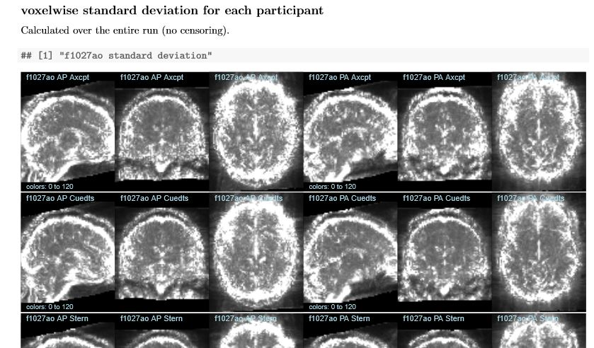

---
jupyter:
  jupytext:
    notebook_metadata_filter: all,-language_info
    split_at_heading: true
    text_representation:
      extension: .Rmd
      format_name: rmarkdown
  kernelspec:
    display_name: R
    language: R
    name: ir
---

# Use automated dynamic reports
## What are automated dynamic reports?
"Dynamic reports" is a generic term for files (like this notebook) that combine code and text in a single file, which is then compiled to produce a document. The compiled document may be static (html, pdf, etc.) or interactive, and implementations are available for many programming languages (R, python, matlab, etc.), and text styles (markdown, latex, [knitr](https://yihui.org/knitr/), etc.). In research I suggest using dynamic reports in two somewhat different ways: for describing specific one-off analyses, and for dataset QC and other automated analyses. 

The first use replaces the common practice of describing the results of any particular analysis in word documents, copy-pasting images and tables in as needed from statistical software. Copy-paste works for small things, but quickly becomes inconvenient, such as if you decide to change a color or symbol, all the plots need to be copy-pasted in again. Identifying the source of each image or statistic (e.g., to change a threshold or check a formula) with only the word document is often time consuming, and may be impossible. Dynamic documents can serve the same purpose of combining text and results for easy sharing, but with the major advantage that the source of images, tables, etc. can be checked, and much more efficiently updated when needed. (I now use knitr for essentially all analyses, whether I expect they will be seen by others or not.) 

The second broad use case is that of automation, in which a single **template** is compiled or run many times. For example, for the DMCC we produce a set of standard knitr documents summarizing the data for each participant (an example set is [on osf](https://osf.io/7xkq9/); see also [dualmechanisms](https://github.com/ccplabwustl/dualmechanisms/)). We spent a lot of time working out what would be most useful for determining the quality of the various types of data collected during this particular experiment, and then how the information could be efficiently and clearly displayed. But once this was decided and a set of files made to show the data for one participant, the files were converted to templates which can be quickly and easily used for any other participant.

## Some suggestions for using automated dynamic reports
There is no single set of best practices when writing dynamic reports or any other type of scientific code, but I will share a few suggestions and thoughts that may both give a sense of what's possible and reduce the likelihood of problems. 

The first set of choices are of which languages to use for the programming and text part of the report, which I believe is largely a matter of personal preference and what your colleagues are using. I use knitr, R, and LaTeX ([tutorial here](https://mvpa.blogspot.com/2020/03/introductory-knitr-tutorial.html)), but again, these are not the only options. 

An important choice is how the finished documents will be used: will they be compiled to a static file (e.g., pdf, html, word) or to something more interactive (such as this Jupyter notebook)? pdfs and other static documents (assuming the source is stored with the compiled version) have the advantage of always looking the same and being easy to archive and share (such as for a publication's supplemental information; <https://osf.io/p6msu/> is one of my favorites); once compiled they can be viewed without the need for particular software and their formatting will not change. Interactive documents can be good for teaching and demonstrations, but I think static (compiled to standard formats) is more stable for long-term storage or wide sharing. 

A general warning is to be careful about how caching and scoping is handled in whichever report system you use. With R and knitr I habitually clear the environment and cache before compiling a document, and the code chunks are run in top-down order. But caching can allow the figure or statistic from a previous compilation to be improperly included, and some interactive systems allow chunks to be run out of order ([described here, for example](https://yihui.org/en/2018/09/notebook-war/)), breaking the (to me, all-important) link between code and displayed result.

### Keep variables consistent and non-creative
When writing code for template use, I recommend that the variable changes needed to compile the document for any particular participant (or group, etc.) are clearly explained and collected at the top of the file. Using consistent naming of key variables (such as `sub.id` for subject ID) and flagging key sections helps non-experts navigate the files and simplifies long-term maintenance. For example, the DMCC55B supplemental knitr files all start with a `startup` code chunk such as this from [behavioralSession_individualDifferences.rnw](https://osf.io/yv56d/):
```{r}
# rm(list=ls());     # clear R's workspace (commented for the demo)
# options(warnPartialMatchDollar=TRUE);    # safety option: warns if column names specified with $ don't match exactly

# change this variable to the local copy of this directory; download from https://openneuro.org/datasets/ds003465/
in.path <- "d:/temp/DMCC_box/DMCC55B/derivatives/questionnaires/";  

# should not need to change the code below here to reproduce the manuscript statistics
use.robust.stats <- TRUE;   # whether to use robust statistics or not for the means and SEMs
```

### Use batch scripts to compile many reports
Once a report template is made, other scripts can be used to manage and streamline its compilation. For example, here is part of a `startup` code chunk for a knitr file that generates a report on a a single participant's performance:
```{r}
###### change the variables starting here

sub.id <- "9999";    #  subject (participant) id to run this time (in quotes)
use.boxr <- TRUE;    # if running this code at wustl and want files downloaded from box.

temp.path <- "d:/temp/";   
# path to a local directory. One file will be written into temp.path as the code runs regardless of the use.boxr setting. 

###### should not need to change any code below here
```
If I wanted to compile this report for a dozen participants I could make a dozen copies of the .rnw template, put one subject ID into the `sub.id` variable of each, and then compile each one by clicking the RStudio button, but that is tedious and it'd be easy to make a typo. It is more efficient to use a script to handle the duplication and text edits, such as this (non-executable code):
```{r}
out.path <- "d:/temp/out/";   # where files will be written
git.path <- "d:/gitFiles/";   # local git directory for input template

sub.ids <- c("1111", "2222", "3333");  # subject IDs to run

# check if out.path exists, and make it if not. (do not run)
# if (!dir.exists(out.path)) { dir.create(out.path); }

# in.file <- readLines(paste0(git.path, "template_ERfilmTask.rnw"));   # read in the template knitr
# for (sub.id in sub.ids) {    # sub.id <- sub.ids[1];
#  s.path <- paste0(out.path, sub.id, "/");   # make a subdirectory of out.path for each person
#  if (!dir.exists(s.path)) { dir.create(s.path); }
#  
#  out.file <- gsub('do.sub <- "9999";', paste0('do.sub <- "', sub.id, '";'), in.file);    # put in subject ID
#  cat(out.file, file=paste0(s.path, sub.id, "_ERfilmTask.rnw"), sep="\n");    # write out the knitr template with this person's info
# }
```
This sort of batch script can also be used to put a single subject ID into multiple templates, to write a script to compile a group of files for one subject ID, etc.

## Tying it together
Dynamic reports can make it straightforward and efficient to highlight important and diagnostic features in your dataset, such as done elsewhere in this section. For example, DMCC55B [QC_SD_volume.pdf](https://osf.io/xchwm/) [QC_SD_volume.rnw source](https://osf.io/3872s/), shows temporal standard deviation images for eight runs for each of the 55 participants:


The [code](https://osf.io/3872s/) making this pdf may strike you as surprisingly short: just 135 lines contain the LaTeX, code calling AFNI to create the standard deviation images if needed, and plotting the images themselves.
